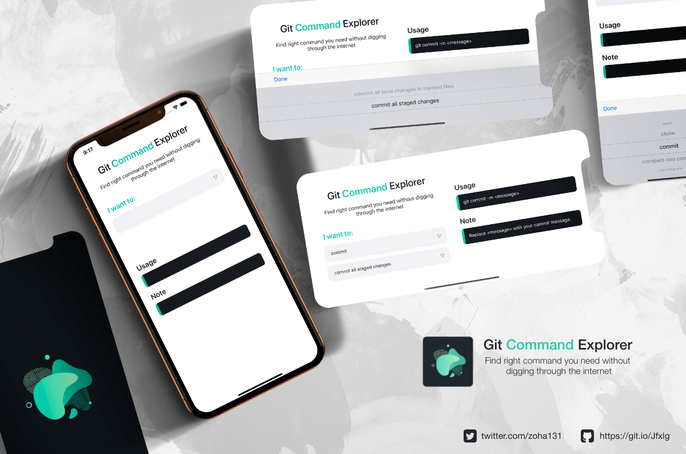

# Git Explorer


<a href="https://www.linkedin.com/in/zoha131/">
    </a>


**Git Explorer** is a simple iOS application to search git command on one click. Dedicated to all Software Developers with ❤️.


## About
This app contains the most used git commands. You can find them pretty easily without banging on the Internet and Google.


## 📸 Screenshots




## App Features:
- Search the git commands.
- View the usage of the git command.
- View the short description of that git command.


## To Do List
- [ ] Dark Mode
- [ ] Online Doc Link
- [ ] Scrolling in portrait
- [ ] Only Usage and Note part scrolling in landscape
- [ ] More git command
- [ ] Testing

## Concept, I have learned by doing this project
- Auto Layout
- Custom Compund UIView
- UIPickerView
- JSONSerialization
- NSArray, NSDictionary
- UITextField, .inputView, .inputAccessoryView


## App Review:
This app has been reviewed by [@marinbenc](https://twitter.com/marinbenc) and [@Adam9Rush](https://twitter.com/adam9rush). Click on the image to watch the review.

[](https://www.raywenderlich.com/10527046-review-my-stuff/lessons/8)

## Inspiration

This project is inspired from GitExplorer-Android ~ Thanks to him.

  [GitExplorer-Android](https://github.com/Shashank02051997/GitExplorer-Android)

## Speacial Thanks To
- The Amighty Allah
- [raywenderlich.com](https://www.raywenderlich.com/) for the amazing **RW Community Care!**
- All the mentors of **RW Bootcamp**
- All the fellow students of **RW Bootcamp**

## Contributing

Please fork this repository and contribute back using
[pull requests](https://github.com/Zoha131/GitExplorer-iOS/pulls).

Any contributions, large or small, major features, bug fixes, are welcomed and appreciated
but will be thoroughly reviewed .

### Contact - Let's become friend
- [Twitter](https://twitter.com/zoha131)
- [Github](https://github.com/zoha131)
- [Linkedin](https://www.linkedin.com/in/zoha131/)
- [Facebook](https://www.facebook.com/zoha131)

<p>
Don't forget to star ⭐ the repo it motivates me to share more open source
</p>

## License

```
MIT License

Copyright (c) 2020 MD Abir Hasan Zoha

Permission is hereby granted, free of charge, to any person obtaining a copy
of this software and associated documentation files (the "Software"), to deal
in the Software without restriction, including without limitation the rights
to use, copy, modify, merge, publish, distribute, sublicense, and/or sell
copies of the Software, and to permit persons to whom the Software is
furnished to do so, subject to the following conditions:

The above copyright notice and this permission notice shall be included in all
copies or substantial portions of the Software.

THE SOFTWARE IS PROVIDED "AS IS", WITHOUT WARRANTY OF ANY KIND, EXPRESS OR
IMPLIED, INCLUDING BUT NOT LIMITED TO THE WARRANTIES OF MERCHANTABILITY,
FITNESS FOR A PARTICULAR PURPOSE AND NONINFRINGEMENT. IN NO EVENT SHALL THE
AUTHORS OR COPYRIGHT HOLDERS BE LIABLE FOR ANY CLAIM, DAMAGES OR OTHER
LIABILITY, WHETHER IN AN ACTION OF CONTRACT, TORT OR OTHERWISE, ARISING FROM,
OUT OF OR IN CONNECTION WITH THE SOFTWARE OR THE USE OR OTHER DEALINGS IN THE
SOFTWARE.
```
